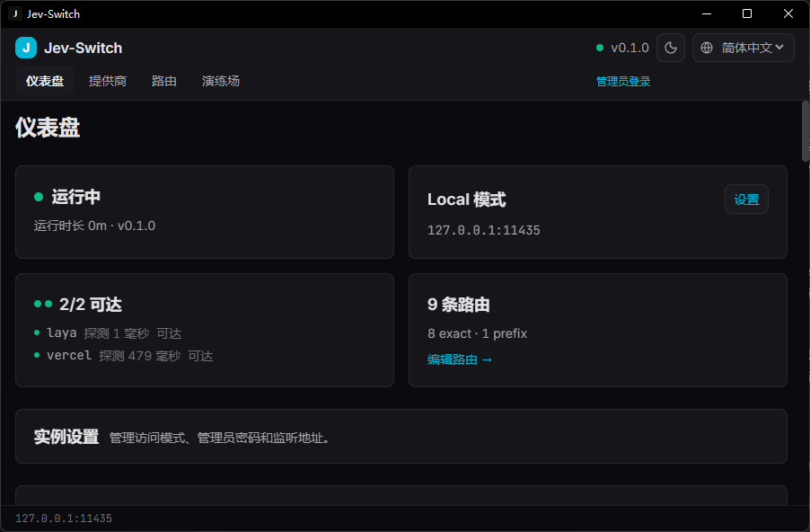

# jev-switch

[](https://github.com/ARCJ137442/jev-switch/actions/workflows/ci.yml)

Jev Switch 是一个轻量的 **Jev 协议模型网关**：把对外服务入口连接到可复用的上游接入配置，由可编辑路由图决定实际调用路径。Rust/axum daemon 承担协议转换、路由和转发；模型推理由上游服务执行。交付形态包括 React 控制台、Tauri 桌面应用与 Docker 服务。



更多 Dashboard 活动、入口路由图与演练场界面见[截图图册](docs/screenshots.md)。

## 特性

- **两类调用入口**：对外服务入口由外部模型 ID、上游路由与策略组成；上游接入配置保存地址、凭据和该账号可用的模型。一个上游配置可被多个服务入口复用。
- **双态运行**：`local` 默认仅监听 loopback 并免调用 token；`cloud` 默认对外监听并要求调用 token，管理操作另走管理员会话。两种模式都可路由到本机、LAN 或云端上游；`local` 不代表离线。详见 [部署说明](docs/deployment.md) 与 [范围基线](docs/12-路线收缩与三线作战计划.md)。
- **Jev 原生接口**：`POST /v1/systemone` 使用 Jev 请求/响应形状；Vercel 等适配器负责上游方言转换。网关不加载模型权重。
- **可编辑调用路由 DAG**：支持对外入口、路由节点和提供商模型端口之间的多跳与分支，并配置候选优先级和失败处理；简单直连只是 DAG 的一种形式。
- **演练场横向比较**：可比较多个对外入口、直接上游模型或混合目标；结果分别呈现实际路径、耗时、usage 与错误。
- **密钥边界**：上游 key 留在 daemon；管理 API 只返回脱敏状态，不提供明文读回接口。不要把真实 key 提交到仓库或聊天。
- **四页控制台**：Dashboard、Providers、Routing、Playground；当前提供简体中文和英文，语言注册表可扩展。
- **契约驱动**：Rust `ts-rs` 生成前端类型到 `ui/src/generated/`；协议及路由不变量见 `docs/contracts/`。

## 架构

Rust workspace（`rs/Cargo.toml`）+ React 控制台（`ui/`）+ Tauri 壳（`src-tauri/`）：

| crate | 职责 | 依赖边界 |
|---|---|---|
| `jev-protocol` | 协议内核类型：`JevRequest`/`JevResponse`/`Answer` 判别联合、`noul_probability()`、feature `ts-rs` 类型导出 | **零 IO**：仅 serde / serde_json |
| `jev-core` | Router DAG（select/plan/failover）、冻结 trait `ProtocolAdapter`/`UpstreamAdapter` + `Registry`、`RetryPolicy`、redact | **无** axum / reqwest |
| `jev-adapters` | Vercel + Laya 上游实现、VercelProtocol 翻译、厂商 DTO | 厂商方言**只活在本 crate** |
| `jev-switch-daemon` | axum HTTP、配置/数据库、管理 API、静态 UI 托管 | 组装协议、路由与适配器 |
| `ui/` | React 控制台：Dashboard / Providers / Routing / Playground | 开发端口 5173；类型由 `ts-rs` 生成 |
| `src-tauri/` | Windows 桌面壳与随包 sidecar | MSI / NSIS |

```text
调用者：网关地址 + 调用 token + 对外模型 ID
   │
   ▼
对外服务入口（独立路由集合与策略）
   │
   ▼
可编辑调用路由 DAG
   │
   ▼
提供商接入配置（地址 + 凭据 + 模型端口）
   │
   ▼
上游适配器（当前内置 Vercel、Laya） -> 上游模型服务
```

## API 端点总表

HTTP surface 按调用、管理、事件与统计分组；端点随管理能力演进，不固定为早期 README 中的“8 个”。默认端口为 `11435`：local 默认 loopback，cloud 默认 `0.0.0.0`；可显式配置监听地址。开发 UI 的 CORS origin 为 `127.0.0.1:5173` 与 `localhost:5173`。

| Method | Path | 形状要点 |
|---|---|---|
| 调用 | `/health`, `/v1/models`, `/v1/systemone` | 健康身份、可公开模型、Jev 原生推理请求 |
| 提供商与路由 | `/v1/admin/providers*`, `/v1/admin/routes` | 接入配置、探测/直调与路由图管理 |
| 服务入口 | `/v1/admin/endpoints*`, `/v1/admin/config/default_strategy` | 对外模型 ID、路由策略与启停 |
| 访问与观测 | `/v1/admin/tokens*`, `/v1/admin/stats`, `/v1/admin/events*`, `/v1/stats/my`, `/v1/events/my*` | 调用权限、统计、历史与事件流 |
| 运行管理 | `/v1/admin/mode`, `/v1/admin/listen`, `/v1/admin/status`, `/v1/admin/config/*` | 模式/监听管理、TOML 导入导出与存储状态 |

完整 DTO、鉴权边界与错误语义以当前 [HTTP 契约](docs/contracts/05-HTTP契约.md)、[入口网关修订](docs/contracts/07-入口网关修订.md)和后端实现为准。

## 配置

配置文件位置由 `JEV_SWITCH_CONFIG` 指定，未设置时使用用户配置目录中的 `providers.toml`。首次启动时读取 TOML 并导入 SQLite；之后 SQLite 统一快照是运行配置权威来源。外部编辑提示漂移，需通过控制台显式导入；也可导出 TOML 作为备份。`JEV_SWITCH_DATA_DIR` 可指定 SQLite 数据目录。

仓库示例 [`rs/providers.example.toml`](rs/providers.example.toml) 配有 Vercel 和 Laya 的地址、模型路由及 `AI_GATEWAY_API_KEY` 环境变量引用。真实 key 不应写进 Git；提供商页可管理接入配置并只显示脱敏状态。

## 快速开始

```powershell
# 1. 终端 A：先设置环境，再启动后端（默认 local：127.0.0.1:11435）
$env:JEV_SWITCH_CONFIG="rs\providers.example.toml"
# 若要使用 Vercel，启动 daemon 前取消下一行注释并替换为真实 key
# $env:AI_GATEWAY_API_KEY="<your-key>"
cargo run --manifest-path rs/Cargo.toml

# 2. 终端 B：启动前端
npm run dev --prefix ui    # http://127.0.0.1:5173
```

前端可通过 `http://127.0.0.1:5173` 连接本机 daemon。生产构建由 daemon 同源托管 UI。Docker 默认使用 cloud 模式；先为管理密码和公开调用 Token 配置本机 `.env`，然后启动：

```bash
docker compose up -d
```

若要在 Docker 部署中调用 Vercel 上游，也需在 `.env` 配置 `AI_GATEWAY_API_KEY`。

## 测试与门禁

| 门禁 | 命令 | 预期 |
|---|---|---|
| Rust workspace 单测与集成 | `cargo test --manifest-path rs/Cargo.toml --workspace --locked --offline` | 按当前工作树运行；不要复用历史固定计数 |
| Rust + ts-rs | `cargo test --manifest-path rs/Cargo.toml --workspace --features ts-rs --locked --offline` | CI 同时检查生成物无漂移 |
| UI 测试 / 类型检查 / 构建 | `npm test --prefix ui` / `npm run lint --prefix ui` / `npm run build --prefix ui` | 当前 `lint` 脚本执行 TypeScript 检查（`tsc --noEmit`）；使用当前 `ui/package.json` 脚本 |
| GitHub Actions | CI / Release workflows | 状态以对应提交的 workflow 结果为准；本地构建不代表远端 CI 或发布通过 |

## 文档

从 [当前入口网关计划](docs/design/ENDPOINT-GATEWAY-ALIGNMENT-PLAN.md) 和 [目标重评](docs/OPUS5-GOAL-REASSESSMENT.md) 开始，再按需查看 [文档索引](docs/README.md)、[契约目录](docs/contracts/00-INDEX.md)、[发版手册](docs/RELEASE.md) 与[最新联调记录](docs/verification/2026-09-24-entry-gateway-integration.md)。历史计划和验收仅证明各自版本与覆盖范围，不代表当前整版验收。

## 开发说明

本项目由 AI 编码代理（MiMo、Claude Code 会话）协作构建，文档级作者逐件署名见各文件头与 [docs/README](docs/README.md) 索引；此披露同时满足 awesome-jev 等列表的 AI 辅助投稿规则。

## License

Licensed under **MIT OR Apache-2.0**：

- [LICENSE-MIT](LICENSE-MIT)
- [LICENSE-APACHE](LICENSE-APACHE)

## 当前验收状态

**状态截至 2026-09-26 21:48（北京时间）。** P1–P4 产品与 Web 能力已实现并分项验收。Release dry-run 的 Windows 便携包已冷启动；壳、daemon 与服务端 UI 资源都和同批构建清单相符，并复用了已有用户配置。当前 AppData 保留 2 个提供商、9 条路由、7 个公开入口和 34 条调用历史。调用历史以 request ID、入口/路由、HTTP 状态、耗时、token 与上游次数作为摘要，原始 JSON 收在折叠详情中。

同一便携运行时的 Playground 已用同一份内置输入跑通公开入口↔公开入口、直连上游↔直连上游、公开入口↔直连上游三种比较；六列均成功调用本地 Laya，HTTP 200，request ID 与 SQLite route trace 对齐。该实例的 Vercel 公开入口也实测 HTTP 200；远端 dry-run workflow 已构建 MSI、NSIS 与便携 artifact 并通过哈希核对，Docker cloud 持久化和 CI 测试也有通过记录。

桌面验收边界：你提供了 v0.1.0 Tauri 界面截图，并人工确认“关窗留托盘、点菜单恢复窗口”通过；这证明当时实例的 Hide/Restore，不扩写成托盘 Exit、精确构建哈希或冷启动恢复。公开图册收录 Dashboard、活动摘要、Routing 入口/DAG 和 Playground；Providers 原图因含脱敏 key 前后缀及真实接入地址而仅保留本机。正式 [v0.1.0 Release](https://github.com/ARCJ137442/jev-switch/releases/tag/v0.1.0) 已发布，包含 Windows MSI、NSIS、便携 ZIP 和配套 Docker 镜像；该发布过程没有追加 Laya 请求。最新计划、证据与未完成项见[实施计划](docs/design/ENDPOINT-GATEWAY-ALIGNMENT-PLAN.md)及[便携版运行验收记录](docs/verification/portable-runtime-acceptance-2026-09-26.md)。
