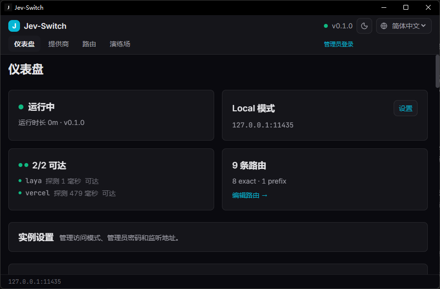

# jev-switch

[](https://github.com/ARCJ137442/jev-switch/actions/workflows/ci.yml)

Jev Switch 是一个轻量的 **Jev 协议模型网关**：把对外服务入口连接到可复用的上游接入配置，由可编辑路由图决定实际调用路径。Rust/axum daemon 承担协议转换、路由和转发；模型推理由上游服务执行。交付形态包括 React 控制台、Tauri 桌面应用与 Docker 服务。



更多 Dashboard 活动、入口路由图与演练场界面见[截图图册](docs/screenshots.md)。未来功能方向见 [ROADMAP.md](ROADMAP.md)。

## 特性

- **两类调用入口**：对外服务入口由外部模型 ID、上游路由与策略组成；上游接入配置保存地址、凭据和该账号可用的模型。一个上游配置可被多个服务入口复用。
- **双态运行**：`local` 默认仅监听 loopback 并免调用 token；`cloud` 默认对外监听并要求调用 token，管理操作另走管理员会话。两种模式都可路由到本机、LAN 或云端上游；`local` 不代表离线。详见 [部署说明](docs/deployment.md) 与[当前入口网关计划](docs/design/ENDPOINT-GATEWAY-ALIGNMENT-PLAN.md)。
- **Jev 原生接口**：`POST /v1/systemone` 使用 Jev 请求/响应形状；Vercel 等适配器负责上游方言转换。网关不加载模型权重。
- **当前源码上游覆盖范围**：内置适配器为 Vercel、Laya、TypeSafe SystemOne 与 OpenRouter。TypeSafe 可连接官方 API（默认 `https://api.typesafe.ai/v1/systemone`、模型 `jev-latest`），也可连接提供相同 Jev `/v1/systemone` 请求/响应格式的本地服务；OpenRouter 通过结构化 JSON Chat Completions 做上游转换。这不等于提供普通 OpenAI/Anthropic 对外入口。官方实测与 OpenRouter 边界见[核验记录](docs/verification/typesafe-official-live-2026-09-29.md)和[OpenRouter adapter 记录](docs/verification/openrouter-adapter-2026-09-30.md)。`v0.6.3` 修订 Android PKCS12 类型识别和签名密码回退，并保持 v0.6.2 的 JSON 设置备份、真实路由 activity 辉光、Routing HUD 自动隐藏、Android keepalive/tile 源码、懒加载页面和官网图标化；Tauri/Android 原生人工边界仍见对应核验记录。
- **可编辑调用路由 DAG**：支持对外入口、路由节点和提供商模型端口之间的多跳与分支，并配置候选优先级和失败处理；简单直连只是 DAG 的一种形式。
- **演练场横向比较**：可比较多个对外入口、直接上游模型或混合目标；结果分别呈现实际路径、耗时、usage 与错误。
- **密钥边界**：上游 key 留在 daemon；管理 API 只返回脱敏状态，不提供明文读回接口。不要把真实 key 提交到仓库或聊天。
- **模型目录发现**：Providers 可让 daemon 通过上游 `/v1/models` 获取账户模型并回填列表，同时显示 HTTP 状态和延迟；浏览器不直连上游，也不会把 key 写入配置或响应。
- **首页运行遥测**：Dashboard 展示当前 daemon 会话的入口/出口速率、累计字节、活跃请求、成功/失败/failover、网关平均延迟和 daemon 进程 CPU/内存；采样数据只在内存中保留，无法精确获得的 Tauri WebView/上游指标明确显示不可用。
- **Headless CLI Phase 1**：`jev-switch-cli` 通过 daemon HTTP API 提供 `status`、`models`、`invoke`、`routes`、`events`，支持 JSON/表格输出，适合 Termux、SSH 与脚本；TUI 和完整 Android 原生交互仍后置。详见 [CLI 文档](docs/CLI.md)。
- **Android APP**：作为正式下载渠道维护，优先级次于 Windows 桌面。v0.5.0 Release 中的 debug-signed APK 是历史构建；v0.6.3 源码包含稳定签名 workflow、PKCS12/JKS 自动识别、前台 service、常驻通知、Quick Settings tile 和统一网关状态桥。配置四个签名 Secret 后，Android job 会附稳定签名 APK；首次打开直接进入完整 UI，“默认关闭”仅表示不自动启动网关服务；首页可以启动/停止本机网关。后台 service、通知、Quick Settings tile、局域网、旋转/键盘稳定性仍按各功能的实际设备证据验收。详见 [Android 构建与验收计划](docs/design/ROADMAP-PLAN-ANDROID-EXPERIMENTAL.md)。
- **当前迭代入口**：路由画布/HUD、演练场批量矩阵、Provider/Entry 搜索、统计/设置、运行控制和探测偏好按[用户反馈迭代计划](docs/design/USER-FEEDBACK-ITERATION-PLAN.md)分阶段推进。
- **图标与运行效率**：主导航、Dashboard 状态速览、调用活动和 Routing 高频工具已有 Lucide 语义图标；Dashboard 连通性探测限制并发并合并状态提交，health 状态共享，隐藏页暂停遥测。具体测量和范围见[图标/性能验证记录](docs/verification/ui-icon-performance-2026-09-30.md)。
- **五页控制台**：Dashboard、Providers、Entries、Routing DAG、Playground；当前提供简体中文和英文，语言注册表可扩展。
- **契约驱动**：Rust `ts-rs` 生成前端类型到 `ui/src/generated/`；协议及路由不变量见 `docs/contracts/`。

## 架构

Rust workspace（`rs/Cargo.toml`）+ React 控制台（`ui/`）+ Tauri 壳（`src-tauri/`）：

| crate | 职责 | 依赖边界 |
|---|---|---|
| `jev-protocol` | 协议内核类型：`JevRequest`/`JevResponse`/`Answer` 判别联合、`noul_probability()`、feature `ts-rs` 类型导出 | **零 IO**：仅 serde / serde_json |
| `jev-core` | Router DAG（select/plan/failover）、冻结 trait `ProtocolAdapter`/`UpstreamAdapter` + `Registry`、`RetryPolicy`、redact | **无** axum / reqwest |
| `jev-adapters` | Vercel、Laya、TypeSafe 上游实现、VercelProtocol 翻译、厂商 DTO | 厂商方言**只活在本 crate** |
| `jev-switch-daemon` | axum HTTP、配置/数据库、管理 API、静态 UI 托管 | 组装协议、路由与适配器 |
| `jev-switch-cli` | Termux/SSH/headless HTTP 客户端（Phase 1） | 只调用 daemon API，不复制路由、SQLite 或 provider key |
| `ui/` | React 控制台：Dashboard / Providers / Entries / Routing DAG / Playground | 开发端口 5173；类型由 `ts-rs` 生成 |
| `src-tauri/` | Windows 桌面壳与随包 sidecar | MSI / NSIS / Standalone 源码构建 |

```text
调用者：网关地址 + 调用 token + 对外模型 ID
   │
   ▼
对外服务入口（独立路由集合与策略）
   │
   ▼
可编辑调用路由 DAG
   │
   ▼
提供商接入配置（地址 + 凭据 + 模型端口）
   │
   ▼
上游适配器（当前内置 Vercel、Laya、TypeSafe SystemOne） -> 上游模型服务
```

## API 端点总表

HTTP surface 按调用、管理、事件与统计分组；端点随管理能力演进，不固定为早期 README 中的“8 个”。默认端口为 `11435`：local 默认 loopback，cloud 默认 `0.0.0.0`；可显式配置监听地址。开发 UI 的 CORS origin 为 `127.0.0.1:5173` 与 `localhost:5173`。

| Method | Path | 形状要点 |
|---|---|---|
| 调用 | `/health`, `/v1/models`, `/v1/systemone` | 健康身份、可公开模型、Jev 原生推理请求 |
| 提供商与路由 | `/v1/admin/providers*`, `/v1/admin/routes` | 接入配置、探测/直调与路由图管理 |
| 服务入口 | `/v1/admin/endpoints*`, `/v1/admin/config/default_strategy` | 对外模型 ID、路由策略与启停 |
| 访问与观测 | `/v1/admin/tokens*`, `/v1/admin/stats`, `/v1/admin/events*`, `/v1/admin/telemetry`, `/v1/stats/my`, `/v1/events/my*` | 调用权限、历史、事件流与当前会话遥测 |
| 运行管理 | `/v1/admin/mode`, `/v1/admin/listen`, `/v1/admin/status`, `/v1/admin/config/*` | 模式/监听管理、TOML 导入导出与存储状态 |

完整 DTO、鉴权边界与错误语义以当前 [HTTP 契约](docs/contracts/05-HTTP契约.md)、[入口网关修订](docs/contracts/07-入口网关修订.md)和后端实现为准。

## 配置

配置文件位置由 `JEV_SWITCH_CONFIG` 指定，未设置时使用用户配置目录中的 `providers.toml`。首次启动时读取 TOML 并导入 SQLite；之后 SQLite 统一快照是运行配置权威来源。外部编辑提示漂移，需通过控制台显式导入；也可导出 TOML 作为备份。`JEV_SWITCH_DATA_DIR` 可指定 SQLite 数据目录。

仓库示例 [`rs/providers.example.toml`](rs/providers.example.toml) 配有 Vercel、Laya、TypeSafe 官方及本地 SystemOne-compatible endpoint 示例。官方 TypeSafe 需配置 Bearer key；本地服务按需配置 key。真实 key 不应写进 Git；提供商页可管理接入配置并只显示脱敏状态。

## 快速开始

```powershell
# 1. 终端 A：先设置环境，再启动后端（默认 local：127.0.0.1:11435）
$env:JEV_SWITCH_CONFIG="rs\providers.example.toml"
# 若要使用 Vercel，启动 daemon 前取消下一行注释并替换为真实 key
# $env:AI_GATEWAY_API_KEY="<your-key>"
cargo run --manifest-path rs/Cargo.toml

# 2. 终端 B：启动前端
npm run dev --prefix ui    # http://127.0.0.1:5173

# 3. 可选：终端 C 使用 headless CLI
cargo run --manifest-path rs/Cargo.toml -p jev-switch-cli -- status
```

前端可通过 `http://127.0.0.1:5173` 连接本机 daemon。生产构建由 daemon 同源托管 UI。Docker 默认使用 cloud 模式；先为管理密码和公开调用 Token 配置本机 `.env`，然后启动：

```bash
docker compose up -d
```

若要在 Docker 部署中调用 Vercel 上游，也需在 `.env` 配置 `AI_GATEWAY_API_KEY`。

## 测试与门禁

| 门禁 | 命令 | 预期 |
|---|---|---|
| Rust workspace 单测与集成 | `cargo test --manifest-path rs/Cargo.toml --workspace --locked --offline` | 按当前工作树运行；不要复用历史固定计数 |
| Rust + ts-rs | `cargo test --manifest-path rs/Cargo.toml --workspace --features ts-rs --locked --offline` | CI 同时检查生成物无漂移 |
| UI 测试 / 类型检查 / 构建 | `npm test --prefix ui` / `npm run lint --prefix ui` / `npm run build --prefix ui` | 当前 `lint` 脚本执行 TypeScript 检查（`tsc --noEmit`）；使用当前 `ui/package.json` 脚本 |
| GitHub Actions | CI / Release workflows | 状态以对应提交的 workflow 结果为准；本地构建不代表远端 CI 或发布通过 |

## 文档

从 [当前入口网关计划](docs/design/ENDPOINT-GATEWAY-ALIGNMENT-PLAN.md) 和 [目标重评](docs/OPUS5-GOAL-REASSESSMENT.md) 开始，再按需查看 [ROADMAP.md](ROADMAP.md)、[文档索引](docs/README.md)、[契约目录](docs/contracts/00-INDEX.md)、[发版手册](docs/RELEASE.md)、[09-24 联调历史记录](docs/verification/2026-09-24-entry-gateway-integration.md)、[09-26 便携运行验收](docs/verification/portable-runtime-acceptance-2026-09-26.md)与[Tauri 截图证据](docs/verification/tauri-screenshot-evidence-2026-09-26.md)。历史计划和验收仅证明各自版本与覆盖范围，不代表当前整版验收。

## 开发说明

本项目由 AI 编码代理（MiMo、Claude Code 与 OpenAI Codex）协作构建，文档级作者逐件署名见各文件头与 [docs/README](docs/README.md) 索引。本轮路线图与文档修订由 **GPT-6 Luna xhigh（OpenAI Codex）** 协助完成。AI 生成内容不替代可复核的源码、测试与运行证据。

## License

Licensed under **MIT OR Apache-2.0**：

- [LICENSE-MIT](LICENSE-MIT)
- [LICENSE-APACHE](LICENSE-APACHE)

## 数据与凭据

Jev-Switch 是路由网关，不在本机运行模型推理。每次调用的请求数据会被转发到该入口选中的上游，因此 `local` 模式仍可能向远程服务发送数据；云端部署时，请求会经过部署网关所在的服务器。SQLite 历史保留调用所需的安全元数据和路由追踪，不保存原始请求体或模型答案。上游 API key 由 daemon 持有，管理接口只返回掩码状态、不提供明文读回。

## 当前验收状态

**正式发行版本截至 2026-10-01：**源码候选版本为 `0.6.3`，GitHub Release 将由 `v0.6.3` tag 的 CI 生成。v0.6.3 的 Rust、UI、Tauri 壳、JSON 备份、真实路由 activity、Android keepalive 构建门禁和官网图标化已自动验证；桌面核心路径、官方 TypeSafe 调用及 Android 初步安装/调用的历史人工证据分别按记录标注。原生桌面 WebView、托盘、稳定签名 APK、Android service/tile/通知和跨硬件性能仍需人工验收。

Release dry-run 的 Windows 便携包已冷启动；壳、daemon 与服务端 UI 资源都和同批构建清单相符，并复用了已有用户配置。2026-09-26 的 AppData 核验包含 2 个提供商、9 条路由、7 个公开入口和 34 条调用历史。调用历史摘要优先呈现 request ID、入口/路由、HTTP 状态、耗时、token 与上游次数，原始 JSON 收在折叠详情中。

同一便携运行时的 Playground 已用同一份内置输入跑通公开入口↔公开入口、直连上游↔直连上游、公开入口↔直连上游三种比较；六列均成功调用本地 Laya，HTTP 200，request ID 与 SQLite route trace 对齐。该实例的 Vercel 公开入口也实测 HTTP 200；远端 dry-run workflow 已构建 MSI、NSIS 与便携 artifact 并通过哈希核对，Docker cloud 持久化和 CI 测试也有通过记录。

验收边界：维护者已人工确认 v0.4.0 便携/Standalone 桌面核心路径、官方 TypeSafe 调用及 v0.5.0 Android 初步安装/官方调用；MSI/NSIS 安装器、Android 原生 service/tile/通知、OpenRouter live call、真实用户配置恢复和全链路性能仍按各自核验记录处理。v0.5.0 Release 的 Android APK 使用临时 debug 签名，仅作历史证据；v0.6.3 将验证稳定签名 APK 的 PKCS12/JKS 兼容和 Release 上传。详细边界见[下一轮用户反馈计划](docs/design/USER-FEEDBACK-ITERATION-PLAN-NEXT.md)和对应发布核验记录。
