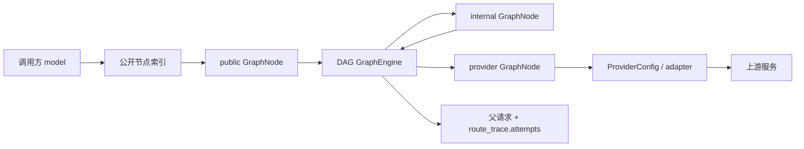

# Jev Switch DAG 节点引擎与三类用户视图计划

**状态：** 架构提案，未进入实现或 Release 承诺
**日期：** 2026-10-04
**范围：** 路由内核、运行时配置、管理 API、控制台信息架构与 Agent 操作契约

> 本文是一次架构级决策记录和执行计划。它不改变当前版本能力，也不授权立即迁移数据或新增顶级页面。

## 1. 决策摘要

Jev Switch 的底层统一为一个 **DAG 节点引擎**。用户层呈现三类节点视图：

| 用户视图 | 领域含义 | 是否持有上游密钥 | 当前对应物 |
|---|---|---:|---|
| 入口 | 对外开放、可被调用的节点 | 否 | `service_endpoints` + 入口左侧路由 |
| 节点 | 只在图内复用的中间节点 | 否 | 当前只有隐式 alias，没有独立元数据 |
| 提供商（出口） | 终端上游资源和适配器接入 | 是，由 daemon 持有 | `providers` + 路由终点 |

“入口”不再被视为与“节点”平行的另一套路由实体；它是带有对外暴露属性和调用策略的图节点。提供商仍然是凭据与适配器配置对象，但在 DAG 中以终端节点参与选路。

本计划采用以下决策：

1. **一份图真相。** 节点、边、策略和校验由 DAG 引擎统一拥有；入口页、节点页、提供商页和路由画布都是投影或编辑入口，不各自维护路由副本。
2. **提供商配置与图节点分离。** `ProviderConfig` 继续负责 `kind/base/models/api_key`；图只引用 provider ID，不把密钥、适配器状态复制进节点记录。
3. **入口是公开节点的投影。** 保留 `/v1/admin/endpoints` 兼容 API，内部逐步改为查询 `exposure=public` 的节点。现有调用方、历史 `endpoint_id` 和入口策略继续有效。
4. **中间节点先从隐式 alias 显化。** 先从现有 `RouteEdge` 推导节点视图，再增加可选的名称、说明、启停和策略元数据；不先复制出一张独立 routes 表。
5. **图写入原子化。** 节点、边、公开暴露和策略必须作为一个图版本提交；校验失败时 SQLite 快照、内存 Router、入口索引和 UI 全部保持旧版本。
6. **兼容优先于重命名。** 当前 `left/right`、`service_endpoints`、provider ID 和公开 model ID 继续作为兼容边界。新 API 可用 `from/to` 和 `node_id`，但转换只发生在边界。

## 2. 当前事实与问题

当前实现已经具备 DAG 选路内核，但用户模型仍分裂在不同层：

- `RouteEdge.left/right` 已支持入口、别名和 provider 多跳；`Router::plan` 按边展开、拒绝环路并生成候选。
- `RuntimeConfigSnapshot` 将 provider map 与 route edges 作为运行时权威快照；TOML 只作为兼容导入/导出和漂移检测来源。
- `service_endpoints` 保存公开入口的策略、启用状态和时间信息；入口路由仍落在统一 route snapshot 中。
- 入口删除拥有级联清理；provider、alias 和入口的删除语义目前分散在不同管理路径。
- UI 路由图已经把节点显示为 `entry/alias/provider`，但 alias 没有可编辑元数据，也没有“节点”管理页面。
- `/v1/admin/endpoints` 是公开入口 CRUD；`/v1/admin/routes` 是整图边表；两者都可能修改同一份运行时图。

这造成四个架构风险：

1. 同一个概念在入口、路由和 provider 页面重复出现，用户无法判断哪个页面拥有最终状态。
2. 中间节点只能通过边的 `left` 字符串隐式存在，无法安全命名、禁用、说明或审计。
3. 入口 API 和整图 API 都能写路由，原子性和冲突处理容易出现分叉。
4. Agent 只能拼接入口 API、路由 API 和 provider API 的组合操作，无法以一个图操作完成“创建节点、接边、公开、回滚”。

## 3. 目标领域模型

### 3.1 节点

第一阶段使用稳定 `node_id`，保留现有 ID 作为兼容值。节点类型由显式字段或可靠派生关系确定：

```text
GraphNode {
  node_id: string,
  kind: public | internal | provider,
  display_name: string?,
  description: string?,
  enabled: bool,
  exposure: private | public,
  public_models: [string],
  strategy: StrategyConfig,
  provider_id: string?,
  metadata: object
}
```

约束：

- `provider` 节点必须引用一个已存在的 provider 配置，不能在图节点中携带 API key。
- `internal` 节点不得被公开调用，除非通过一个 `public` 节点或公开 model matcher 暴露。
- `public` 节点可以只有元数据而没有出边，但必须明确显示为不可调用；不能伪造健康状态。
- `provider` 节点是终端节点，不能拥有有效出边。
- `node_id` 在全图命名空间内唯一；provider ID 与内部节点 ID 冲突时拒绝写入，不静默覆盖。
- `public_models` 的初始兼容规则为 `[node_id]`；未来允许一个公开节点承载多个公开 model matcher，但不在第一阶段实现。

### 3.2 边

```text
GraphEdge {
  edge_id: stable id?,
  from: node_id or matcher,
  to: node_id,
  match: exact | prefix,
  upstream_model: string?,
  priority: i32,
  sticky: none | session,
  on_error: next | fail,
  enabled: bool
}
```

实现初期允许 `edge_id` 由边字段稳定计算，避免立即迁移历史路由。对外兼容层继续序列化为 `left/right`；新图 API 使用 `from/to`，避免把方向语义隐藏在左右布局里。

### 3.3 策略归属

策略归属统一到出边集合的来源节点：

- `public` 节点的策略决定一次公开请求如何处理其候选分支。
- `internal` 节点可以拥有策略，用于被多个入口复用时统一控制。
- 边上的 `on_error/sticky/priority` 仍是候选级细节，不被全局策略覆盖。
- 多跳时，根节点优先级和后续节点优先级分层保留；不得把所有边的 priority 压成一个全局数字。

## 4. 目标运行流程



GraphEngine 只负责图解析、候选排序、能力/启用状态筛选和路径审计，不负责 HTTP 方言、密钥读取或 UI。adapter 继续负责上游协议转换；daemon 负责持久化、鉴权、调用日志和实时 route activity。

## 5. 用户界面信息架构

### 5.1 顶级页面

最终页面结构建议为：

1. **入口**：只看对外开放节点。创建公开模型、启停、策略、调用统计和入口级历史。
2. **节点**：只看内部复用节点。编辑名称/说明/启停/策略、查看上下游度数和被哪些入口引用。
3. **提供商**：只看出口接入配置、密钥、模型目录、连通性和 adapter 诊断。
4. **路由**：全图视图，负责连接、布局、优先级和请求活动；不重复承载完整的 provider 密钥表单。

入口页和节点页显示的是同一 GraphNode 的不同过滤视图；双击节点仍进入对应页面并聚焦目标对象。路由画布是跨类型总览，不再把“入口到提供商”作为固定两栏假设。

### 5.2 页面边界

| 操作 | 入口 | 节点 | 提供商 | 路由 |
|---|---:|---:|---:|---:|
| 公开 model/暴露范围 | 主操作 | 不可用 | 不可用 | 查看来源 |
| 节点名称/说明/启停 | 公开节点 | 主操作 | 不可用 | 快速编辑 |
| API key/base/kind/models | 不可用 | 不可用 | 主操作 | 只显示引用 |
| 连接边与优先级 | 摘要 | 摘要 | 摘要 | 主操作 |
| 调用统计 | 入口聚合 | 被引用视图 | provider attempt | 全图活动 |

第一阶段不删除“入口”页面，也不把三个页面合并成一个大表。先让用户理解“入口是公开节点，提供商是出口配置，节点是内部复用”这组三分关系。

## 6. 兼容与迁移策略

### 6.1 旧数据映射

| 旧数据 | 新语义 | 迁移动作 |
|---|---|---|
| `service_endpoints.id` | `GraphNode(kind=public, exposure=public)` | 复制策略、enabled、时间字段和公开 ID |
| `RouteEdge.left` 为入口 ID | public 节点出边 | 原边保持不变 |
| 仅作为 `left` 出现、且不是 provider/入口的 alias | `GraphNode(kind=internal, exposure=private)` | 推导并写入兼容节点元数据 |
| `Config.providers[id]` | `GraphNode(kind=provider)` + `ProviderConfig` | provider 配置仍单独保存 |
| `RouteEdge.right` provider ID | provider 节点引用 | 不复制 key 或模型数组 |
| 旧 `[router]` | exact edge | 沿用现有导入规则 |

迁移必须先检测以下冲突：provider ID 与入口/alias 同名、环路、未知 right、重复公开 model。冲突时进入诊断状态并保留旧快照，不能自动猜测覆盖。

### 6.2 版本化快照

第一阶段不直接把现有 JSON 快照拆成多张表。将 `RuntimeConfigSnapshot` 增加明确的 schema version 和可选 `nodes` 字段：

```text
RuntimeConfigSnapshot v2 {
  schema_version: 2,
  providers: {...},
  nodes: [...],
  routes: [...],
  source_toml_fingerprint: string
}
```

旧快照缺少 `nodes` 时按上述映射派生，读后以 v2 写回；旧版 daemon 读取新快照前必须通过版本门禁拒绝或执行受控降级，不能静默丢失节点元数据。TOML 导出先保持 `providers/routes/router` 兼容段；节点显示元数据在兼容格式中无法表达时，导出提示“仅导出可执行图，节点展示元数据保留在 SQLite”。

### 6.3 删除和回滚

- 删除 public 节点：删除其公开暴露和出边，继续清理因此失去终点的内部分支；历史调用保留。
- 删除 internal 节点：默认拒绝并列出入边/出边；确认后才执行同样的断枝清理。
- 删除 provider：沿当前已实现语义清理直接引用和无终点分支，不删除历史记录。
- 所有图变更使用版本号/哈希做冲突检测；撤销恢复完整节点、边、策略和公开暴露，不只恢复几条边。

## 7. API 演进

### 7.1 兼容 API 保留

继续支持：

- `/v1/admin/endpoints`：公开节点的兼容投影。
- `/v1/admin/routes`：完整边文档的兼容读写入口，内部转为 GraphDocument 写入。
- `/v1/admin/providers`：ProviderConfig 的密钥掩码与配置管理。

兼容 API 的响应增加可选 `node_id/kind` 字段前，先完成 ts-rs 与客户端容错；不在同一个版本中强制替换 `id/left/right`。

### 7.2 新图 API（设计目标）

```text
GET  /v1/admin/graph
PUT  /v1/admin/graph              # 节点、边、策略一次提交
GET  /v1/admin/nodes?kind=internal
POST /v1/admin/nodes
PUT  /v1/admin/nodes/{id}
DELETE /v1/admin/nodes/{id}
```

推荐 `GraphDocument`：

```json
{
  "version": 7,
  "nodes": [{"id":"jev-fast","kind":"internal","enabled":true}],
  "edges": [{"from":"jev","to":"jev-fast","match":"exact","priority":5}],
  "providers": {"typesafe": {"ref": "typesafe"}}
}
```

真正开放写入前必须冻结：鉴权、冲突响应、节点删除预览、公开 model matcher、策略继承、审计与回滚形状。节点 CRUD 不应绕过 `PUT /graph` 的完整图校验。

## 8. 分阶段执行计划

### Phase 0：架构冻结与只读证据

- 增加 GraphNode/GraphDocument/GraphValidation 错误的领域设计，不改运行路径。
- 为当前配置生成 node/edge 映射报告，列出冲突、孤儿 alias、入口和 provider 重名。
- 冻结术语、ID 兼容策略、策略归属和删除预览文案。
- 输出 Agent/CLI 的图查询示例，保证人工和 Agent 看到同一 GraphDocument。

**门槛：**现有 Rust/UI/Tauri 测试不回归；报告能解释每个现有 route node 的类型。

### Phase 1：内核模型与纯校验

- 在 `jev-core` 增加 GraphNode、GraphEdge/兼容转换和完整 DAG 校验。
- 将现有 `Router` 的解析入口改为消费 GraphDocument 的边投影；保留 `RouteEdge` 兼容函数。
- 覆盖环、未知节点、provider 非终端、禁用节点、prefix、别名分支、策略继承和 provider ID 冲突。

**门槛：**现有路由行为逐例等价；性能基线不因元数据引入显著回归。

### Phase 2：持久化 v2 与只读管理 API

- `RuntimeConfigSnapshot` 增加版本和 nodes；实现旧快照/TOML 到 v2 的幂等迁移。
- 增加 `GET /v1/admin/graph` 和 `GET /v1/admin/nodes`，不开放写入。
- 入口/路由/provider 兼容 API 与 GraphDocument 做一致性对照测试。

**门槛：**重启、TOML 漂移、导入/导出、删除历史和旧客户端都能保持可解释行为。

### Phase 3：节点页只读预览

- 新增“节点”顶级页面，但先只显示 internal 节点、引用关系、入/出边、公开引用和终端可达性。
- 路由双击节点进入节点页并聚焦；入口页改为 public 节点过滤视图。
- 不在此阶段允许编辑，避免页面先于写入契约成为第二真相。

**门槛：**页面切换、搜索、空/孤儿/禁用状态、移动端布局、Agent 查询结果与路由画布一致。

### Phase 4：原子图编辑与回滚

- 开放 `PUT /v1/admin/graph`，节点、边、策略一次提交。
- 节点创建/重命名/启停/删除提供影响预览；删除必须说明将清理哪些分支。
- UI 节点页、入口页和路由画布共享 GraphDocument 编辑会话、冲突横幅、撤销/重做和保存反馈。
- provider 仍通过 provider API 修改，图提交只修改 provider node ref，不修改密钥。

**门槛：**失败保存不改变任何运行态；成功保存后公开调用、Router、统计、历史和 UI 立即一致；重启恢复同一图版本。

### Phase 5：Agent/CLI 与发布收口

- CLI 增加 `graph/nodes` 查询、影响预览、校验、导出和回滚命令。
- README 增加“Agent 可用的 DAG 图管理能力”示例，注明入口聚合与 provider attempt 双视角。
- 完成 Tauri/Android/服务器 API 回归；新顶级页面和 API 进入正式版本前单独记录人工验收。

## 9. 验收矩阵

| 类别 | 必测场景 |
|---|---|
| 语义 | public → internal → provider；public → 两个 provider；多入口复用一个 internal；provider 终端约束 |
| 校验 | 环路、未知 right、ID 冲突、孤儿节点、禁用分支、prefix 与 exact 共同命中 |
| 策略 | 节点策略继承、边 priority 分层、next/fail、race/load-balance/shadow、sticky |
| 迁移 | 旧 TOML、旧 SQLite、已有入口删除、provider 删除、重启、TOML 漂移与回滚 |
| API | 兼容 endpoints/routes/providers 与 graph/nodes 读写结果一致；409 冲突不丢数据 |
| 记录 | 一次入口父记录聚合多次 provider attempt；route trace 可还原完整节点路径 |
| UI | 入口/节点/提供商三页过滤同一图；路由画布无滚动条；双击聚焦、删除预览、撤销恢复 |
| Agent | 查询、校验、创建节点、接边、公开、预览删除和回滚均能用 CLI/API 完成 |
| 平台 | 普通浏览器、Tauri、Android WebView 的 API/布局一致；不把原生生命周期证据混入图引擎测试 |

## 10. 暂不决策的事项

以下问题需要在 Phase 0 由维护者确认，不能由实现者自行猜测：

1. 一个 public 节点是否允许多个公开 model ID，以及它们是否共享同一策略。
2. internal 节点是否允许单独设置策略，还是只继承调用入口策略。
3. 节点启停是局部禁用并自动绕过，还是禁用即让引用它的公开入口进入不可调用状态。
4. 是否允许 provider ID 与 node ID 长期共用字符串命名空间，还是在新 API 中引入显式 `provider:<id>` 引用。
5. 删除 internal 节点的默认策略是拒绝、断枝清理还是要求显式确认影响图。
6. 图版本回滚保留多少历史、是否纳入调用配置备份，以及 Agent 是否拥有回滚权限。
7. 多租户/cloud 模式下节点和 provider 的所有权边界、调用 token 能看到哪些图元数据。

## 11. 调研依据

- [路由契约](../contracts/03-路由契约.md)：已确认当前语义本身是 DAG，二部图只是最简视图；边字段仍是 `left/right`。
- [入口网关修订](../contracts/07-入口网关修订.md)：已确认入口策略、入口 CRUD、provider 配置边界、历史记录和删除语义。
- `rs/crates/jev-core/src/router.rs`：`Router::plan/resolve` 已按多跳边展开候选，provider 是终端适配器引用。
- `rs/crates/jev-switch-daemon/src/db/mod.rs`：SQLite `runtime_config` 快照是当前 provider/route 运行时权威；TOML 负责兼容导入/导出和漂移检测。
- `rs/crates/jev-switch-daemon/src/admin/endpoints.rs`：入口元数据位于 `service_endpoints`，入口路由仍合并进运行时图。
- `ui/src/components/routing/dag.ts`：前端已经按 `entry/alias/provider` 三种节点类型绘制 DAG，但 alias 尚无独立管理对象。

## 12. 结论

新增“节点”页面是合理方向，但它必须建立在统一 GraphDocument 之上。当前最安全的下一步是 **Phase 0 的只读调查、术语冻结和映射报告**，而不是立刻增加节点 CRUD 或把入口表改名。这样既能减少用户对“入口数量”的认知负担，也能保留已有入口 API、路由动画、provider attempt 历史和 Android/桌面运行边界。
