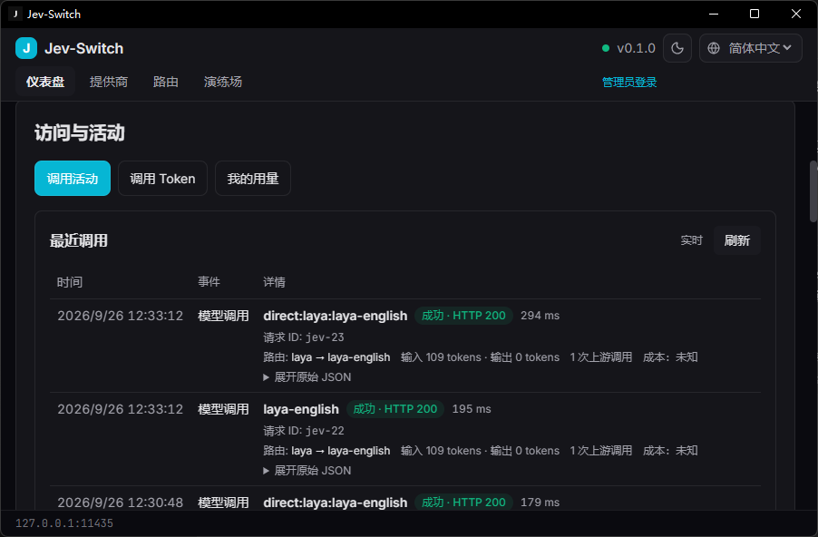
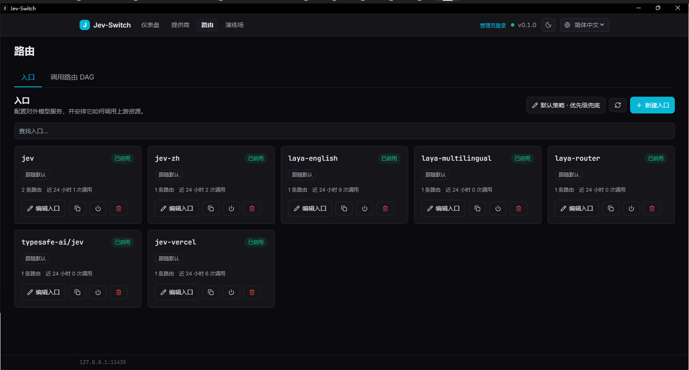
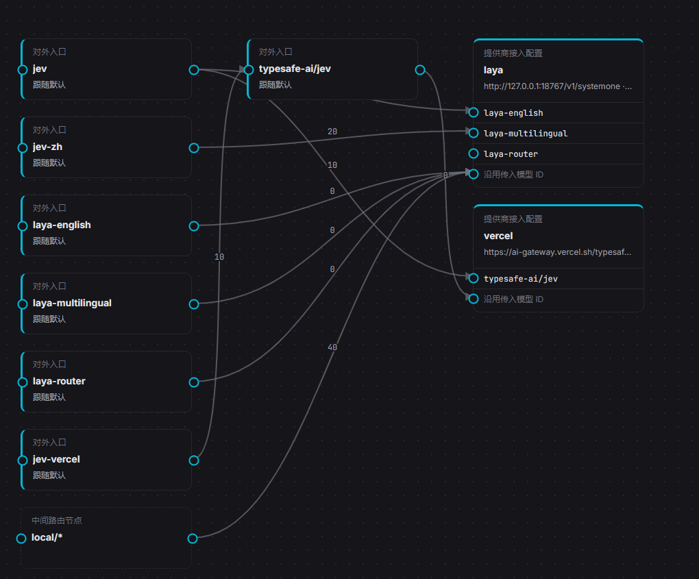
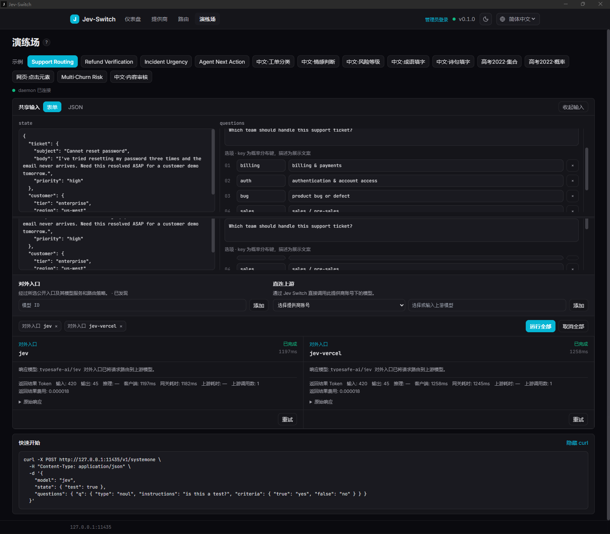

# Jev Switch UI 截图

以下截图由用户于 2026-09-26 提供，展示 Jev Switch `v0.1.0` 的 Tauri 深色界面。它们说明当前产品的信息层级与交互，不等同于对 Release 二进制哈希、原生窗口逻辑尺寸或 DPI 的独立验证。

## Dashboard

展示 Local 地址、上游可达状态和路由概况。

## 调用活动

活动行先呈现请求 ID、入口/路由、HTTP 状态、耗时和用量；原始 JSON 收在折叠详情中。

## 对外入口

对外模型 ID 作为独立入口卡片呈现，可查看启用状态、路由数、调用概况并进入编辑。

## 调用路由 DAG

路由图展示从对外入口，经可配置路由节点，到提供商模型端口的关系。

## 演练场横向比较

同一份输入可并排运行多个对外入口；每列单独显示结构化结果、路径、usage 和耗时，原始响应保持折叠。

Providers 配置页截图未列入公开图册，因为原图还包含脱敏 key 片段和真实接入地址。该图仅保留在本机核验归档中。
